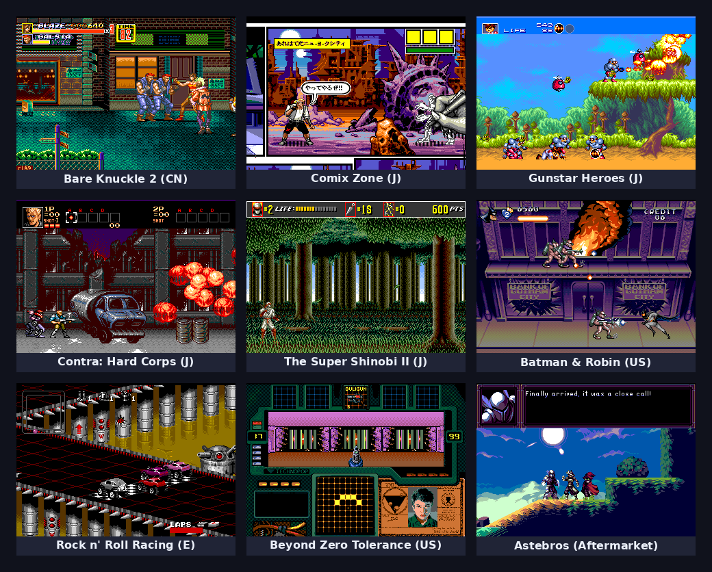

# Mesen

Mesen is a multi-system emulator for Windows, Linux and macOS.

## ✨ Highlights

### 🎮 Multi-System Support

| System | Core Type |
|--------|-----------|
| NES/Famicom | Native |
| SNES/Super Famicom | Native |
| Game Boy / Color | Native |
| Game Boy Advance | Native |
| PC Engine/TurboGrafx-16 | Native |
| Sega Master System / Game Gear | Native |
| **Sega Mega Drive / Genesis** | **Native** |
| WonderSwan | Native |
| Nintendo DS | Libretro Core |

### 🦅 Native Sega Mega Drive / Genesis Core

A from-scratch native Mesen2 core with mono thread for the Sega Mega Drive / Genesis — written in
the same style as the existing NES/SMS/PCE cores, sharing Mesen2's
infrastructure for save states, rewind, debugger, cheats, movies and the video
recorder. The algorithmic reference is the [ares](https://github.com/ares-emulator/ares)
MD core, but the implementation stands alone (no `nall`/`libco`/`sljit`
dependency) — every subsystem is a Mesen2-native `ISerializable` class.

#### Subsystems (`Core/Genesis/`, ~14.5k LOC)

| Module | Role |
|--------|------|
| [GenesisConsole](Core/Genesis/GenesisConsole.h) | `IConsole` implementation; owns all subsystems, drives `RunFrame`, region detection, cart load |
| [GenesisM68K](Core/Genesis/GenesisM68K.h) | Motorola 68000 interpreter (full EA + instruction table, interrupts, disassembler) |
| [GenesisZ80](Core/Genesis/GenesisZ80.h) | Z80 APU interpreter (the SMS-style CPU reused for Mega Drive audio) |
| [GenesisVdp](Core/Genesis/GenesisVdp.h) | Yamaha YM7101 VDP — H32/H40, V28/V30, interlace, sprite DMA, planes A/B + window, shadow/highlight |
| [GenesisYm2612](Core/Genesis/GenesisYm2612.h) | Yamaha YM2612 / OPN2 6-channel FM synth with SSG-EG and DAC |
| [GenesisPsg](Core/Genesis/GenesisPsg.h) | SN76489 PSG (3 tone + 1 noise channel) |
| [GenesisMemoryManager](Core/Genesis/GenesisMemoryManager.h) | M68K + Z80 buses, I/O space, VDP/PSG/YM2612 routing, Z80 bus arbitration |
| [GenesisEeprom](Core/Genesis/GenesisEeprom.h) | M24C I2C EEPROM (X24C01 → M24C512) for battery saves on Acclaim-mapper carts |
| [GenesisControlManager](Core/Genesis/GenesisControlManager.h) + [Input/](Core/Genesis/Input/GenesisController.h) | 3-button & 6-button pads, TH/TL select protocol, U+D / L+R conflict resolution |
| [Debugger/](Core/Genesis/Debugger/GenesisDebugger.h) | M68K assembler, disassembler, trace logger, event viewer, VDP tools |

#### Cartridge & Save Support

- **SMD format** auto-detection and 16 KB block deinterleaving (512-byte header)
- **Parallel SRAM** with odd-byte (`/LDS`-selected) and word-wide modes, range validation against the header's `RA` field
- **M24C I2C EEPROM** state machine ported from `ares/component/eeprom/m24c/`, with bit-bang wiring for Acclaim-mapper carts
- **SSF2 bank switching** for >4 MB ROMs (e.g. Super Street Fighter II) — 8 × 512 KB swappable banks
- Region auto-detection from the ROM header string at `$1F0` (`J`/`U`/`E`), with `NtscJapan` for `J` and `JE` (Japanese-origin titles that lock out export hardware), and filename-tag fallback for headerless pirate/hack ROMs
- Battery save/load via Mesen2's `BatteryManager`, with change detection so saves are only written when SRAM/EEPROM actually changed

#### Region & Timing

- `ConsoleRegion::Ntsc`, `Pal`, and `NtscJapan` are all distinguished — the version register at `$A10001` reports the correct PAL flag (bit 6) and domestic/export flag (bit 7), so region-locked titles boot on the right "hardware"
- 262 scanlines / ~59.92 fps (NTSC) or 313 scanlines / ~49.70 fps (PAL); PAL-strict demos (e.g. Titan Overdrive 2) and Japan-only region-locked titles (e.g. Bare Knuckle 2) run correctly

#### Integration with Mesen2

Every Genesis subsystem inherits `ISerializable` and uses the `SV()` serializer macro, so out of the box you get:

- 💾 Save states & rewind
- 🎬 Movie recording / playback
- 🕹️ Debugger (M68K + Z80 disassembly, register viewer, event viewer, VRAM/CRAM/VSRAM memory viewers)
- 🎨 Cheat codes
- 🎥 Built-in video recorder (UTVideo / FFVHUFF / H.264 / VP8)

#### Genesis Gallery

<b>Individual captures</b>

| | | |
|:---:|:---:|:---:|
|  |  |  |
| Bare Knuckle 2 (CN) | Comix Zone (J) | Gunstar Heroes (J) |
|  |  |  |
| Contra: Hard Corps (J) | The Super Shinobi II (J) | Batman & Robin (US) |
|  |  |  |
| Rock n' Roll Racing (E) | Beyond Zero Tolerance (US) | Astebros (Aftermarket) |

### 🖥️ Cross-Platform Audio/Video with SDL

Mesen uses **SDL2** for cross-platform audio and video output, ensuring consistent performance and compatibility across Windows, Linux, and macOS.

### 🎬 Modern Video Recording

Built-in video recorder with multiple codec support:

| Codec | Type | Quality | Use Case |
|-------|------|---------|----------|
| **UTVideo** | Lossless | Perfect | High-quality archival |
| **FFVHUFF** | Lossless | Perfect | Wide compatibility |
| **H.264** | Lossy | Excellent | Small file size |
| **VP8** | Lossy | Good | Web-friendly output |

### 🎨 Modern Shader Support (Coming Soon)

Integration with **librashader** for advanced CRT, LCD, and custom shader presets - bringing retro gaming visuals to life with authentic display effects.

---

## Releases

The latest stable version is available from the [releases on GitHub](https://github.com/SourMesen/Mesen2/releases).  

## Development Builds

#### <ins>Native builds</ins> (recommended) ####

These builds don't require .NET to be installed.  

* [Windows 10 / 11](https://nightly.link/SourMesen/Mesen2/workflows/build/master/Mesen%20%28Windows%20-%20net8.0%20-%20AoT%29.zip)  
* [Linux x64](https://nightly.link/SourMesen/Mesen2/workflows/build/master/Mesen%20%28Linux%20-%20ubuntu-22.04%20-%20clang_aot%29.zip)  (requires **SDL2**)
* [macOS - Intel](https://nightly.link/SourMesen/Mesen2/workflows/build/master/Mesen%20%28macOS%20-%20macos-13%20-%20clang_aot%29.zip)  (requires **SDL2**)
* [macOS - Apple Silicon](https://nightly.link/SourMesen/Mesen2/workflows/build/master/Mesen%20%28macOS%20-%20macos-14%20-%20clang_aot%29.zip)  (requires **SDL2**)

#### <ins>.NET builds</ins> ####

These builds require **.NET 8** to be installed (except the Windows 7 build which requires .NET 6).  
For Linux and macOS, **SDL2** must also be installed.

* [Windows 7 / 8 (.NET 6)](https://nightly.link/SourMesen/Mesen2/workflows/build/master/Mesen%20%28Windows%20-%20net6.0%29.zip)  
* [Linux x64 - AppImage](https://nightly.link/SourMesen/Mesen2/workflows/build/master/Mesen%20(Linux%20x64%20-%20AppImage).zip)  
* [Linux ARM64](https://nightly.link/SourMesen/Mesen2/workflows/build/master/Mesen%20%28Linux%20-%20ubuntu-22.04-arm%20-%20clang%29.zip)  
* [Linux ARM64 - AppImage](https://nightly.link/SourMesen/Mesen2/workflows/build/master/Mesen%20(Linux%20ARM64%20-%20AppImage).zip)

#### <ins>Notes</ins> ####

Other builds are also available in the [Actions](https://github.com/SourMesen/Mesen2/actions) tab.

**SteamOS**: See [SteamOS.md](SteamOS.md)

## Compiling

See [COMPILING.md](COMPILING.md)

## License

Mesen is available under the GPL V3 license.  Full text here: <http://www.gnu.org/licenses/gpl-3.0.en.html>

Copyright (C) 2014-2025 Sour

This program is free software: you can redistribute it and/or modify
it under the terms of the GNU General Public License as published by
the Free Software Foundation, either version 3 of the License, or
(at your option) any later version.

This program is distributed in the hope that it will be useful,
but WITHOUT ANY WARRANTY; without even the implied warranty of
MERCHANTABILITY or FITNESS FOR A PARTICULAR PURPOSE.  See the
GNU General Public License for more details.

You should have received a copy of the GNU General Public License
along with this program.  If not, see <http://www.gnu.org/licenses/>.
